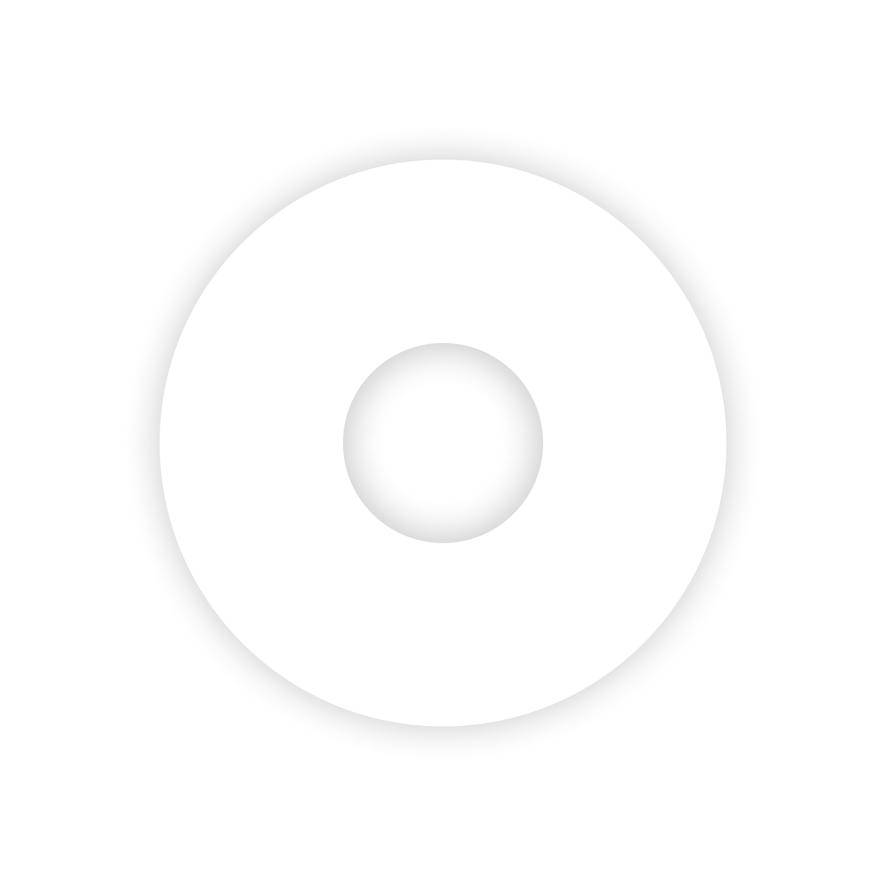
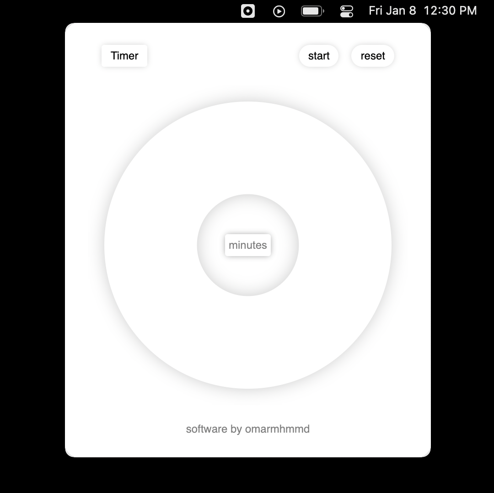

<div align = "center">

<h1>
Timer
</h1>
<p>
A simple & thoughtful menu bar timer app.
</p>
<br>

<br>
<a href="https://timer.omarmhmmd.com/">timer.omarmhmmd.com</a>
</div>

# Timer
A timer app that puts an emphasis on simplicity and thoughtfulness, void of infinite features, unnecessary design, or unpleasant notifications. Designed to be floating on your screen, out of the way, kind of like a cloud. 

## Features
- A simple start, pause, and reset button interface. 
- A single constraint of a timer interval between 1-60 minute(s), because you should be taking a break after an hour.
- Built for the menu bar, but still in the dock if that's your vibe.
- Programmed with <code>electron.js</code> using [<code>menubar by maxogden</code>](https://github.com/maxogden/menubar).

## Installation
```sh
$ yarn add menubar
$ electron timer.js
```


